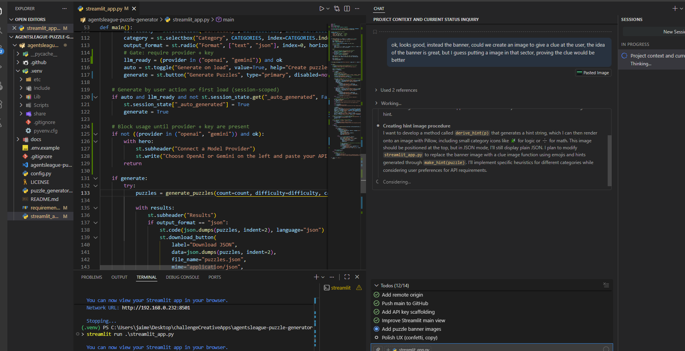
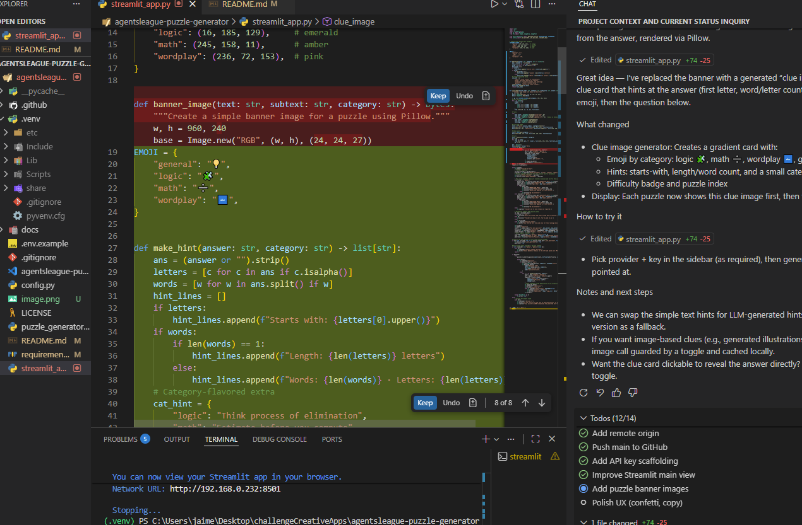

# 🧩 Puzzle Generator – Creative Apps Track

An AI-powered riddle and puzzle generator built with GitHub Copilot. Create unique puzzles, riddles, and brain teasers with customizable difficulty and categories.

**Track:** 🎨 Creative Apps (GitHub Copilot)  
**Agents League:** https://github.com/microsoft/agentsleague  
**Submission Deadline:** March 1, 2026 (11:59 PM PT)  

---

## ✨ Features

- **Dynamic Puzzle Generation** – Create riddles, logic puzzles, and brain teasers on demand
- **Customizable Difficulty** – Easy, Medium, Hard difficulty levels
- **Category Support** – General, Math, Logic, Wordplay, Trivia categories
- **Interactive CLI** – Simple command-line interface for demo and exploration
- **Copilot-Assisted Development** – Built with GitHub Copilot Chat for creative problem-solving

---

## 🚀 Quick Start

### Prerequisites
- Python 3.8+
- GitHub Copilot in VS Code (or GitHub Copilot CLI)
- Git

### Setup

1. **Clone or create your workspace:**
   ```bash
   cd C:\Users\jaime\agentsleague-puzzle-generator
   ```

2. **(Recommended) Create a virtual environment:**
   ```bash
   # Windows (PowerShell)
   python -m venv .venv
   .\.venv\Scripts\Activate.ps1

   # macOS/Linux (bash/zsh)
   python3 -m venv .venv
   source .venv/bin/activate
   ```

3. **Install dependencies:**
   ```bash
   python -m pip install -r requirements.txt
   ```

4. **Configure environment:**
   ```bash
   cp .env.example .env
   # Edit .env (optional for basic demo)
   # Set MODEL_PROVIDER=openai or gemini
   # Add OPENAI_API_KEY=... or GOOGLE_API_KEY=...
   ```

5. **Run the CLI demo:**
   ```bash
   python puzzle_generator.py --count 3 --difficulty medium
   ```

6. **Run the Streamlit UI (optional):**
   ```bash
   # Always use the venv's Python so the right packages/keys are used
   python -m streamlit run streamlit_app.py
   ```

### Expected Output
```
🧩 Puzzle Generator – Demo Run
────────────────────────────────

Puzzle 1: Riddle (Medium)
Question: I speak without a mouth and hear without ears. I have no body, but I come alive with wind. What am I?
Answer: An echo

Puzzle 2: Logic (Medium)
Question: Three switches control three light bulbs in another room. You can toggle the switches, but can only enter the room once. How do you determine which switch controls which bulb?
Answer: Toggle switch 1 for 10 minutes (heating the bulb), then turn it off. Toggle switch 2 on, leave switch 3 off. Enter the room: warm bulb = switch 1, on bulb = switch 2, off bulb = switch 3.
...
```

---

## 📁 Project Structure

```
agentsleague-puzzle-generator/
├── puzzle_generator.py       # Main CLI app
├── requirements.txt          # Python dependencies
├── .env.example              # Environment template
├── .gitignore                # Git ignores (secrets, venv, etc)
├── README.md                 # This file
└── .github/
    └── copilot-instructions.md  # Copilot usage guide
```

---

## 🤖 GitHub Copilot Usage

This project was iteratively developed with GitHub Copilot Chat in VS Code. Key areas where Copilot assisted:

For an ongoing activity log of prompts and decisions, see: docs/copilot-notes.md

### 1. **Puzzle Logic & Generation**
   - Copilot suggested puzzle templates and riddle structures
   - Used Copilot Chat: *"Generate 5 unique riddle formats with setup and answer structure"*
   - Result: Structured puzzle object model with category and difficulty levels

### 2. **CLI Implementation**
   - Copilot provided argparse command-line argument suggestions
   - Used: *"Create a Python CLI with --count, --difficulty, and --category flags"*
   - Result: Clean, professional CLI interface

### 3. **Error Handling & Edge Cases**
   - Copilot Chat for validation logic: *"How do I validate difficulty level and handle invalid input?"*
   - Result: Robust input validation and user-friendly error messages

### 4. **Documentation & Comments**
   - Copilot autocomplete for docstrings and inline comments
   - Used Copilot's suggestions for code clarity and maintainability

### How to Replicate in Your Code
1. Open `puzzle_generator.py` in VS Code
2. Use **Copilot Chat** (`Ctrl+Shift+I` or `Cmd+Shift+I`):
   - Ask for feature ideas or refinements
   - Request explanations of logic
   - Request optimization suggestions
3. Use **Copilot Inline** (`Ctrl+I`):
   - Let Copilot suggest completions for puzzle templates
   - Ask for refactoring ideas

---

## 🎯 How to Run & Demo

### Command-Line Usage
```bash
# Generate 5 medium-difficulty puzzles
python puzzle_generator.py --count 5 --difficulty medium

# Generate hard logic puzzles
python puzzle_generator.py --count 3 --difficulty hard --category logic

# Show available categories
python puzzle_generator.py --help
```

### Web UI (Streamlit)
```bash
python -m streamlit run streamlit_app.py
```
- Open the local URL shown (usually http://localhost:8501)
- Pick difficulty, category, and count from the sidebar
- View puzzles inline or switch to JSON and download
 - For AI generation: choose a provider, apply your API key, and set "Generation mode" to AI

---

## 🔑 API Keys (Optional)

- **Provider:** set `MODEL_PROVIDER` to `openai`, `gemini`, or `none` (default).
- **OpenAI:** set `OPENAI_API_KEY`.
- **Gemini:** set `GOOGLE_API_KEY`.
- Keep `.env` out of git (already in `.gitignore`). For GitHub Actions or deployments, use repository Secrets.

This project doesn’t require keys for the basic CLI/UI templates. Keys enable optional AI-powered generation in the Streamlit UI.

### Using AI generation
- Open the sidebar → Provider & Keys
- Choose `openai` or `gemini`, paste your key, and click "Apply Key"
- Set "Generation mode" to "AI model …" and click Generate
- The Results header shows the source used: `AI (openai|gemini)` or `Templates (fallback)`

### Diagnostics
- Expand "Diagnostics" in the sidebar to confirm:
   - SDK available: yes (package installed in this Python)
   - Key detected in session: yes (the app can read your key)

### Next Steps: Build Your Own Features
Consider these extensions with Copilot help:
- **API Server**: Turn the generator into a REST API (Flask/FastAPI)
- **Web UI**: Create a simple web interface with the puzzles
- **Leaderboard**: Add user scoring and puzzle solving stats
- **Database**: Persist puzzles and user answers

---

## 📋 Submission Checklist

Before submitting to Agents League on **March 1, 2026**:

- [ ] **Repository is public** and pushed to GitHub
- [ ] **README.md** is complete and clear
- [ ] **Code runs without errors** (`python puzzle_generator.py --count 3`)
- [ ] **.env.example** provided (no secrets in repo)
- [ ] **.gitignore** includes `.env`, `__pycache__/`, `*.pyc`, `venv/`
- [ ] **Copilot usage documented** in README (what, how, why Copilot helped)
- [ ] **Demo video created** (2–3 min, showing the app in action)
- [ ] **Read Disclaimer:** https://github.com/microsoft/agentsleague/blob/main/DISCLAIMER.md
- [ ] **Code of Conduct acknowledged:** https://github.com/microsoft/agentsleague/blob/main/CODE_OF_CONDUCT.md
- [ ] **Submit via issue:** https://github.com/microsoft/agentsleague/issues/new?template=project.yml

---

## 🧰 New Machine Setup & Troubleshooting

### Fresh clone setup
1. Clone and enter the folder
   ```bash
   git clone https://github.com/jgarcia92/agentsleague-puzzle-generator.git
   cd agentsleague-puzzle-generator
   ```
2. Create and activate a virtualenv
   ```bash
   # Windows (PowerShell)
   python -m venv .venv
   .\.venv\Scripts\Activate.ps1

   # macOS/Linux (bash/zsh)
   python3 -m venv .venv
   source .venv/bin/activate
   ```
3. Install dependencies
   ```bash
   python -m pip install -r requirements.txt
   ```
4. Optional: copy env and add keys
   ```bash
   cp .env.example .env
   # Then edit .env to add OPENAI_API_KEY or GOOGLE_API_KEY
   ```
5. Run the UI
   ```bash
   python -m streamlit run streamlit_app.py
   ```

### Common issues
- SDK not found (openai/google-generativeai): ensure you installed deps in the active venv and launched Streamlit via `python -m streamlit`.
- Results say "Templates (AI requested but fell back)": the model returned non‑JSON or there was an auth/error. Check sidebar Diagnostics and re‑apply your key.
- Port already in use: `python -m streamlit run streamlit_app.py --server.port 8502`.
- Wrong Python picked up: re‑activate `.venv` and confirm with `python --version`.

---

## 🔒 Security & Legal

- **No Secrets:** All sensitive config in `.env` (not committed)
- **License:** MIT License (see LICENSE if present)
- **Disclaimer:** Read https://github.com/microsoft/agentsleague/blob/main/DISCLAIMER.md before final submission
- **Attribution:** Copilot usage transparently documented

---

## 🤝 Community & Support

- **Agents League Discord:** https://aka.ms/agentsleague/discord
- **Issues & Feedback:** https://github.com/microsoft/agentsleague/issues
- **Watch Battle Replays:** https://aka.ms/agentsleague/battles

---

## 📝 License

MIT License – feel free to use, modify, and share.

---

**Built with ❤️ and GitHub Copilot for Agents League 2026**

**Evidence using Github Copilot**

